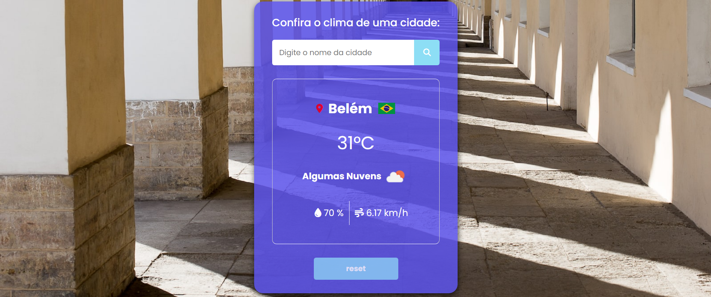

# clima-js

 
Site responsivo usando HTML, CSS e JavaScript, consumindo API´s públicas como: https://flagicons.lipis.dev/flags/4x3/ para bandeiras, https://source.unsplash.com para backgrounds e https://api.openweathermap.org para capturar o clima das cidades.

## Pré-visualização:

[clima-js](https://clima-weather-js.netlify.app/)

